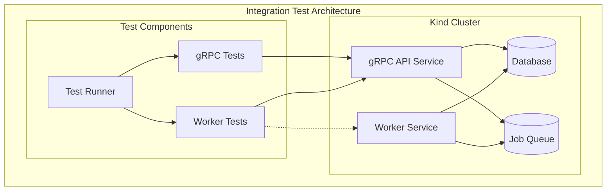
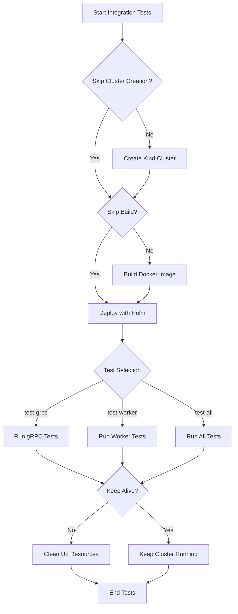
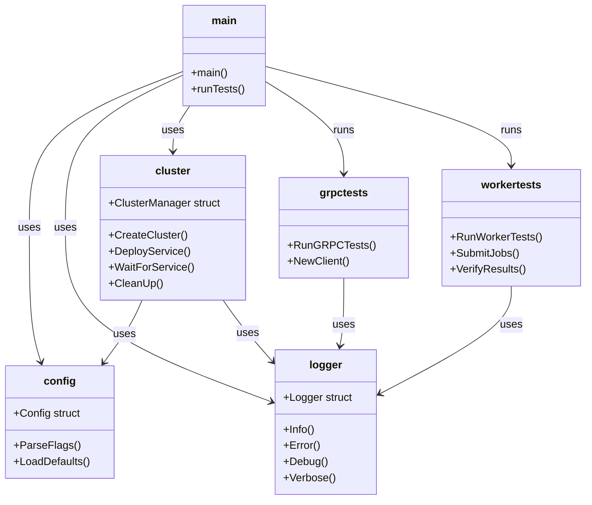
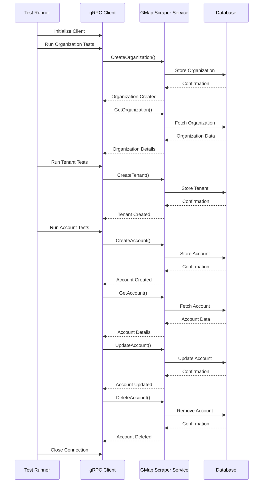
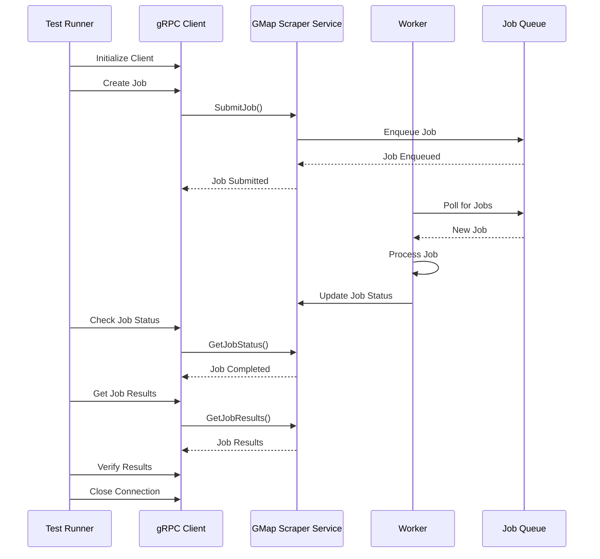
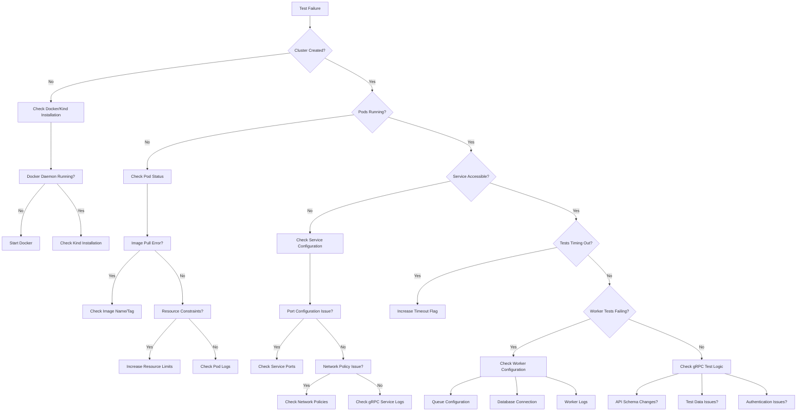

# Integration Tests

This package contains integration tests for the Google Maps Scraper service. The tests are designed to run against a local Kind cluster and test both the gRPC API and worker functionality.



## Overview

The integration tests perform the following operations in sequence:

1. Create a local Kind cluster with a predefined configuration
2. Build and load the Docker image into the cluster
3. Deploy the service using Helm with customizable configuration
4. Run tests against the gRPC API to verify endpoint functionality
5. Run tests against the worker functionality to verify data processing
6. Clean up resources (unless keep-alive is specified)

### Test Execution Flow Diagram



## Prerequisites

The following tools are required to run the integration tests:

- Go 1.22 or later
- Docker (20.10+)
- Kind (0.17+)
- kubectl (1.25+)
- Helm (3.10+)
- grpcurl (`go install github.com/fullstorydev/grpcurl/cmd/grpcurl@latest`)

Ensure all tools are properly installed and available in your PATH before running the tests.

## Running the Tests

You can run the integration tests using the provided Makefile targets:

```bash
# Run all integration tests
make run-integration-tests

# Run only gRPC tests
make run-integration-tests-grpc

# Run only worker tests
make run-integration-tests-worker

# Run tests with verbose logging
make run-integration-tests-verbose

# Run tests and keep the cluster alive after completion
make run-integration-tests-keep-alive

# Clean up integration test resources
make clean-integration-tests
```

### Execution Flow

When you run the tests, the following happens:

1. A new Kind cluster is created (unless `-skip-cluster-creation` is used)
2. The Docker image is built and loaded into the cluster (unless `-skip-build` is used)
3. The service is deployed using Helm with the specified configuration
4. The tests are executed against the deployed service
5. Results are reported with detailed logs (if `-verbose` is enabled)
6. Resources are cleaned up (unless `-keep-alive` is specified)

## Command Line Options

The integration tests support the following command line options:

```
  -cluster-name string       Name of the Kind cluster (default "gmaps-integration-test")
  -image-name string         Docker image name (default "gosom/google-maps-scraper")
  -image-tag string          Docker image tag (default "latest")
  -keep-alive                Keep the cluster alive after tests complete
  -namespace string          Kubernetes namespace for deployment (default "default")
  -release-name string       Helm release name (default "gmaps-scraper-leads-scraper-service")
  -skip-build                Skip building the Docker image
  -skip-cluster-creation     Skip creating a new cluster (use existing)
  -test-all                  Run all tests
  -test-grpc                 Run gRPC tests (default true)
  -test-worker               Run worker tests (default true)
  -timeout duration          Timeout for tests (default 5m0s)
  -verbose                   Enable verbose logging
  -helm-values string        Path to custom Helm values file
  -wait-timeout duration     Timeout for service availability (default 2m0s)
  -context string            Use specific kubectl context
```

### Examples

```bash
# Run with custom timeout and verbose logging
go run ./integration-tests -timeout 10m -verbose

# Use existing cluster and custom image
go run ./integration-tests -skip-cluster-creation -image-name custom/image -image-tag dev

# Run in a specific namespace with custom release name
go run ./integration-tests -namespace test-env -release-name custom-release
```

## Test Structure

The integration tests are organized into the following packages:

- `main.go`: Entry point for the integration tests
- `config/`: Configuration for the integration tests
  - `config.go`: Defines configuration options and command-line flags
  - `defaults.go`: Sets default values for configuration
- `logger/`: Simple logger for the integration tests
  - `logger.go`: Provides logging functionality with configurable verbosity
- `cluster/`: Manages the Kind cluster and deployment
  - `kind.go`: Creates and manages Kind clusters
  - `deploy.go`: Handles Helm chart deployment
  - `wait.go`: Contains functions to wait for service availability
- `grpctests/`: Tests for the gRPC API
  - `grpc_tests.go`: Main entry point for gRPC tests
  - `tests/runner.go`: Test runner that orchestrates the execution of all gRPC tests
  - `tests/organization_test.go`: Organization-related tests
  - `tests/tenant_test.go`: Tenant-related tests
  - `tests/account_test.go`: Account-related tests with CRUD operations
  - `tests/helpers.go`: Helper functions for gRPC tests
- `workertests/`: Tests for the worker functionality
  - `worker_tests.go`: Main entry point for worker tests
  - `tests/job_runner.go`: Handles job submission and monitoring
  - `tests/data_processing_test.go`: Tests for data processing
  - `tests/helpers.go`: Helper functions for worker tests

### Package Structure Diagram



### Test Execution Flow

1. `main.go` parses command-line flags and initializes the test environment
2. The Kind cluster is created and the service is deployed
3. The test runner executes the selected test suites
4. Test results are aggregated and reported
5. Resources are cleaned up if not using keep-alive

### gRPC Test Flow Diagram



### Worker Test Flow Diagram



## Adding New Tests

To add new tests, follow these steps:

1. Add a new test file to the appropriate package (e.g., `grpctests/tests/` or `workertests/tests/`)
2. Implement your test functions using the provided test helpers
3. Register your test in the respective test runner (`runner.go`)
4. Run the tests to verify your changes

### Test Function Template

```go
func TestNewFeature(t *testing.T, client pb.ServiceClient, logger *logger.Logger) {
    // Test setup
    ctx, cancel := context.WithTimeout(context.Background(), 30*time.Second)
    defer cancel()
    
    // Test execution
    resp, err := client.YourMethod(ctx, &pb.YourRequest{
        // Request parameters
    })
    
    // Assertions
    if err != nil {
        t.Fatalf("Failed to call YourMethod: %v", err)
    }
    
    if resp.Status != pb.Status_SUCCESS {
        t.Errorf("Expected SUCCESS status, got: %v", resp.Status)
    }
    
    // Additional assertions...
}
```

## Continuous Integration

These integration tests can be integrated into CI pipelines:

```yaml
# Example GitHub Actions workflow
integration-tests:
  runs-on: ubuntu-latest
  steps:
    - uses: actions/checkout@v3
    - name: Set up Go
      uses: actions/setup-go@v4
      with:
        go-version: '1.22'
    - name: Install Kind
      run: go install sigs.k8s.io/kind@latest
    - name: Install Helm
      run: |
        curl https://raw.githubusercontent.com/helm/helm/main/scripts/get-helm-3 | bash
    - name: Run Integration Tests
      run: make run-integration-tests-verbose
```

## Troubleshooting

If the tests fail, check the following:

- Ensure all prerequisites are installed and properly configured
- Check the logs for error messages using the `-verbose` flag
- Verify that the service is deployed correctly:
  ```bash
  kubectl get pods -n <namespace>
  kubectl describe pod <pod-name> -n <namespace>
  kubectl logs <pod-name> -n <namespace>
  ```
- Check that the gRPC API is accessible:
  ```bash
  kubectl port-forward svc/<release-name> 9000:9000 -n <namespace>
  grpcurl -plaintext localhost:9000 list
  ```
- Verify that the worker is processing jobs by checking its logs
- Check for resource constraints or networking issues in the cluster

### Troubleshooting Decision Tree



### Common Issues and Solutions

#### Pod Startup Failures
- Check resource limits in Helm values
- Verify image pull policies and registry access
- Check for configuration errors in deployment

#### gRPC Connection Issues
- Ensure service ports are correctly exposed
- Check network policies or firewall rules
- Verify TLS configuration if enabled

#### Worker Processing Failures
- Check queue configuration
- Verify database connections
- Check for proper credentials configuration

#### Timeout Issues
- Increase test timeout with `-timeout` flag
- Check for performance bottlenecks
- Verify resource allocation for services

## Advanced Configuration

### Custom Helm Values

You can provide custom Helm values for deployment:

```bash
go run ./integration-tests -helm-values ./custom-values.yaml
```

Example custom values file:
```yaml
resources:
  limits:
    cpu: 1
    memory: 1Gi
  requests:
    cpu: 500m
    memory: 512Mi

config:
  logLevel: debug
  workerConcurrency: 5
  apiRateLimit: 100
```

### Custom Kind Configuration

For advanced Kind cluster configuration, modify the cluster creation in `cluster/kind.go`.

## Environment Variables

The integration tests also support configuration via environment variables:

- `GMAPS_TEST_CLUSTER_NAME`: Kind cluster name
- `GMAPS_TEST_IMAGE_NAME`: Docker image name
- `GMAPS_TEST_IMAGE_TAG`: Docker image tag
- `GMAPS_TEST_NAMESPACE`: Kubernetes namespace
- `GMAPS_TEST_RELEASE_NAME`: Helm release name
- `GMAPS_TEST_TIMEOUT`: Test timeout duration
- `GMAPS_TEST_VERBOSE`: Enable verbose logging (set to "true")