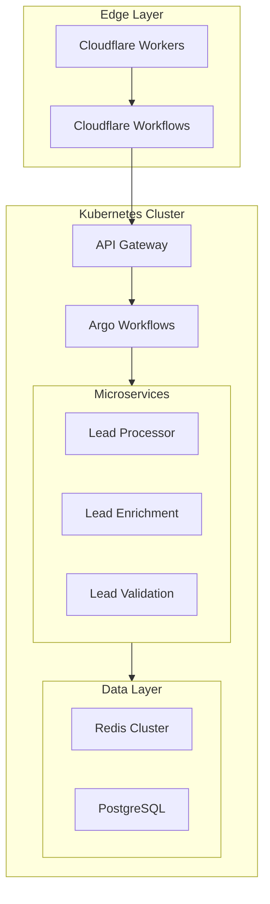
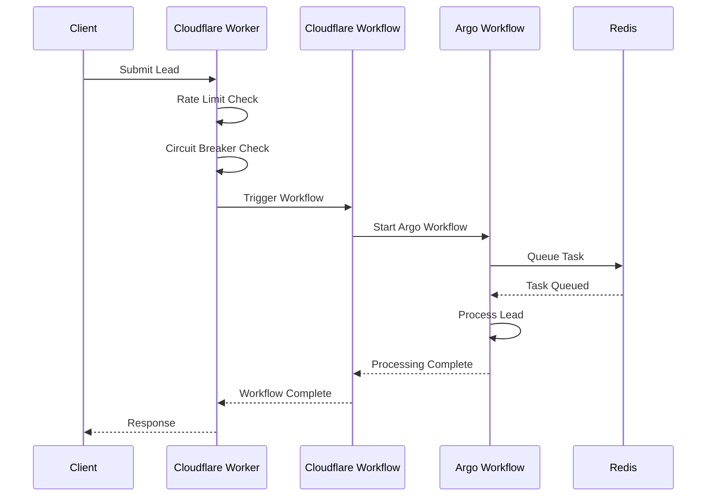
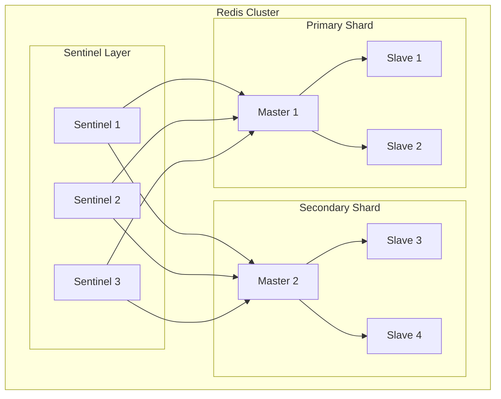
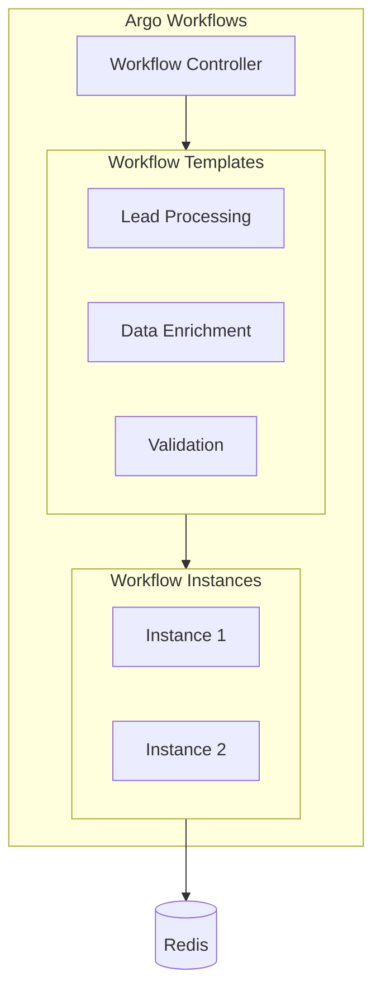
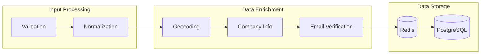
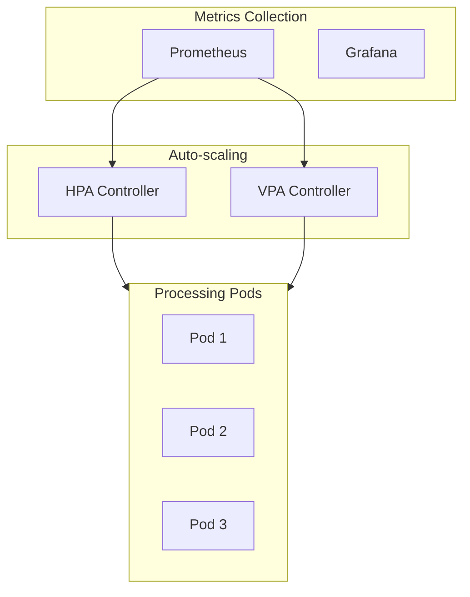
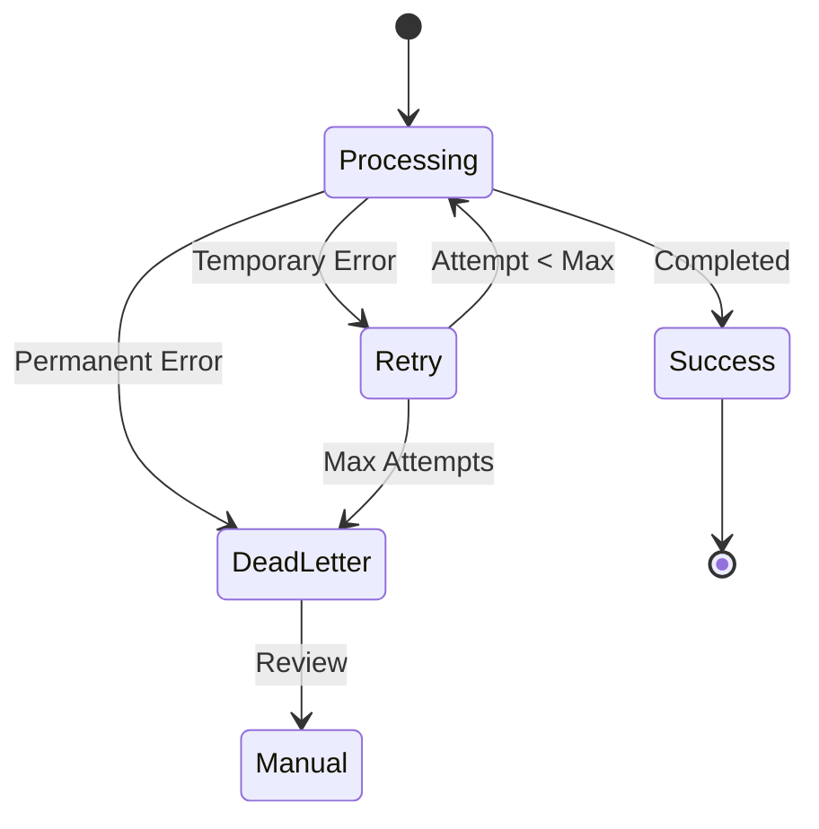
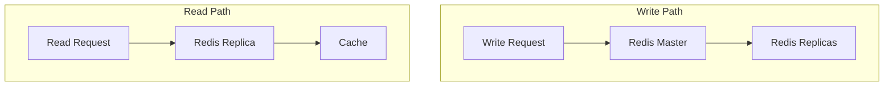
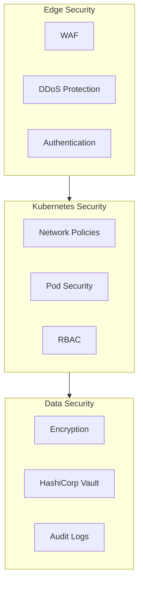
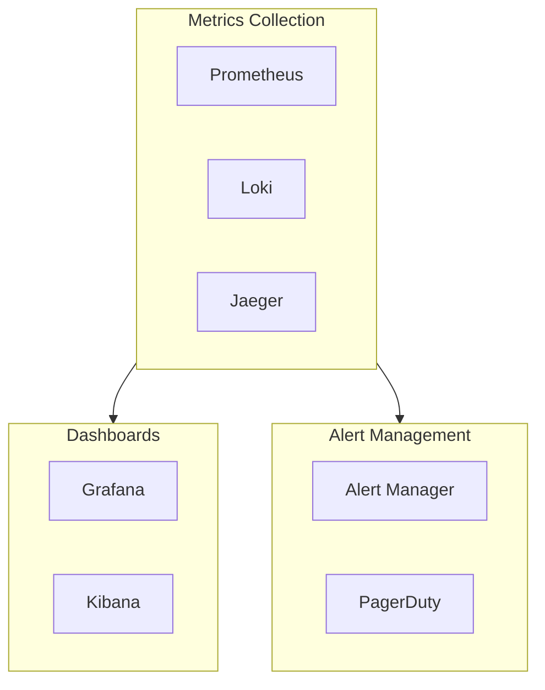

# Orchestration Architecture Design Document (Enhanced)

## Overview

The **Orchestration Architecture** is a **cloud-native**, **highly scalable** system for automated lead sourcing at scale. It integrates **Kubernetes** for robust container orchestration, **Cloudflare Workers** for edge processing, and **Cloudflare Workflows** for multi-step orchestration. On the back end, it relies on a **Redis** cluster for high-availability data storage, task queuing, and distributed coordination.

### Key Features

1. **Distributed Processing**  
   - **Cloudflare Workers** at the edge for request handling and pre-processing  
   - **Kubernetes-based microservices** for core lead processing  
   - **Redis cluster** providing high availability and task orchestration

2. **Intelligent Scheduling**  
   - **Time-zone aware** scheduling  
   - **Adaptive batch processing** of leads  
   - **Priority-based queuing** for urgent tasks

3. **Resilience & Reliability**  
   - **Circuit breaking** at the edge  
   - **Automatic retries** in workflows  
   - **Graceful degradation** of non-critical functions

4. **Scalability**  
   - **Horizontal scaling** with Kubernetes  
   - **Global distribution** via Cloudflare  
   - **Redis cluster** with Sentinel/Cluster mode for fault tolerance

5. **Observability**  
   - **Distributed tracing** across edge, workflows, and microservices  
   - **Structured logging** for consistent analysis  
   - **Metrics collection** in Prometheus/Grafana

---

## Architecture

### Core Components

#### 1. Edge Layer (Cloudflare Workers)

Cloudflare Workers provide an **edge-first** entry point for user requests. They handle request validation, rate limiting, circuit breaking, and forward valid requests to Cloudflare Workflows for orchestration:

```javascript
class LeadSourceWorker {
    constructor(config) {
        this.circuitBreaker = new CircuitBreaker(config.circuitBreaker)
        this.rateLimiter = new RateLimiter(config.rateLimit)
    }

    async handleRequest(request) {
        // Rate limiting & authentication
        if (!await this.rateLimiter.checkLimit(request)) {
            return new Response('Rate limit exceeded', { status: 429 })
        }

        // Optionally enforce worker authentication here (e.g., verifying tokens)
        
        // Circuit breaker for downstream services
        return this.circuitBreaker.execute(async () => {
            const workflow = await this.triggerWorkflow(request)
            return new Response(`Workflow triggered: ${workflow.id}`, { status: 202 })
        })
    }
}
```

**Key Enhancements**  
- **Worker Authentication**: Support for verifying JWT tokens, API keys, or mutual TLS to ensure only authorized requests reach your workflows.  
- **Expanded Rate Limiting**: Fine-grained controls based on IP address, user identity, or custom headers.

---

#### 2. Workflow Orchestration (Cloudflare Workflows)

Cloudflare Workflows orchestrate the multi-step **lead-processing** pipeline. Workflow definitions can include **branching conditions**, **parallel steps**, **and more granular retry policies**:

```yaml
name: lead_processing_workflow
version: 2
triggers:
  - type: worker
    name: lead_source_worker

steps:
  - name: input_validation
    action: validate_lead_data
    input:
      data: ${trigger.payload}
    retry:
      max_attempts: 5
      conditions:
        - on: "data_validation_error"
          max_attempts: 2
          backoff_factor: 1
        - on: "network_timeout"
          max_attempts: 3
          backoff_factor: 2
    
  - name: enqueue_processing
    action: k8s_api
    input:
      endpoint: /api/v1/tasks
      method: POST
      payload:
        type: lead_processing
        priority: ${steps.input_validation.priority}
        data: ${steps.input_validation.output}
    retry:
      max_attempts: 3
      initial_interval: 30s
      max_interval: 5m
      backoff_factor: 2
      conditions:
        - on: "5xx"
        - on: "network_timeout"
```

**Key Enhancements**  
- **Granular Failure Conditions**: Allows different backoff or retry logic based on specific error types (e.g., network timeouts vs. data validation errors).  
- **Conditional Logic**: Workflows can branch if certain steps fail or produce special outputs.

---

#### 3. Processing Cluster (Kubernetes)

Kubernetes manages the containerized lead-processing services. **Horizontal Pod Autoscalers** (HPAs) ensure the system scales with load:

```yaml
apiVersion: apps/v1
kind: Deployment
metadata:
  name: lead-processor
  labels:
    app: lead-processor
spec:
  replicas: 3
  selector:
    matchLabels:
      app: lead-processor
  template:
    metadata:
      labels:
        app: lead-processor
    spec:
      containers:
      - name: processor
        image: lead-processor:latest
        resources:
          requests:
            memory: "256Mi"
            cpu: "500m"
          limits:
            memory: "512Mi"
            cpu: "1000m"
        env:
        - name: REDIS_HOST
          valueFrom:
            configMapKeyRef:
              name: redis-config
              key: host
```

A typical **HorizontalPodAutoscaler** might look like this:

```yaml
apiVersion: autoscaling/v2
kind: HorizontalPodAutoscaler
metadata:
  name: lead-processor-hpa
spec:
  scaleTargetRef:
    apiVersion: apps/v1
    kind: Deployment
    name: lead-processor
  minReplicas: 3
  maxReplicas: 10
  metrics:
  - type: Resource
    resource:
      name: cpu
      target:
        type: Utilization
        averageUtilization: 70
  - type: Resource
    resource:
      name: memory
      target:
        type: Utilization
        averageUtilization: 80
```

---

### Redis Cluster Configuration

To ensure **high availability** and **fault tolerance** within Redis, the architecture uses either **Redis Sentinel** or **Redis Cluster** mode:

1. **Sentinel-based Deployment**  
   - One primary Redis node and multiple replicas.  
   - Automatic failover if the primary goes down.  
   - Works well for smaller-to-medium scale with strong consistency needs.

2. **Native Redis Cluster**  
   - Horizontal sharding built in.  
   - Each node handles a subset of the key space.  
   - Data automatically rebalanced on adding/removing nodes.  
   - Ideal for very large-scale deployments or high request throughput.

#### Sample Sentinel YAML

```yaml
redis:
  sentinel:
    enabled: true
    replicas: 2
    persistence: true
    config:
      sentinelQuorum: 2
      sentinelDownAfterMilliseconds: 5000
      sentinelFailoverTimeout: 60000
```

**Key Considerations**  
- **Failover Testing**: Regularly test sentinel or cluster failover to confirm minimal downtime.  
- **Client Library Support**: Ensure the Redis client in your lead-processor pods supports Sentinel/Cluster discovery.  
- **Replication Lag**: If replication is asynchronous, there can be a small window of data inconsistency during failover.  

---

### Component Interactions

```mermaid
graph TD
    A[Cloudflare Worker] --> B[Rate Limiter]
    B --> C[Circuit Breaker]
    C --> D[Cloudflare Workflow]
    D --> E[Kubernetes API]
    E --> F[Lead Processing Pods]
    F --> G[Redis Task Queue (HA Cluster)]
    G --> H[Redis Aggregator (HA Cluster)]
    H --> I[Result Processing]
```

---

## Implementation Details

### 1. Edge Processing

**Rate Limiting & Authentication**  
Use a robust strategy in Cloudflare Workers for:
- **IP or token-based** rate limiting.  
- **Edge-based authentication** (e.g., JWT) to ensure only valid requests progress.

**Circuit Breaking**  
Employ circuit breakers with thresholds for maximum failures, reset time, etc.:

```javascript
class CircuitBreaker {
    constructor(config = {}) {
        this.failureThreshold = config.failureThreshold || 5
        this.resetTimeout = config.resetTimeout || 60000
        // Additional logic for partial outages or different error codes
    }
}
```

---

### 2. Workflow Orchestration

Use **Cloudflare Workflows** to orchestrate **multi-step processes** with:
- **Granular Retry Policies** for different failure modes  
- **Conditional Branches** for partial successes  
- **Timed triggers** to re-queue tasks if needed

```yaml
steps:
  - name: distribute_tasks
    action: task_distributor
    input:
      tasks: ${steps.task_generation.output}
    retry:
      max_attempts: 3
      initial_interval: 30s
      max_interval: 5m
      backoff_factor: 2
      conditions:
        - on: "5xx"
        - on: "network_timeout"
        - on: "partial_failure"
```

---

### 3. Kubernetes Integration

**Capacity Planning**  
- Start with **baseline requests** (CPU/Memory) that ensure stable performance for typical loads.  
- Configure **limits** to contain runaway usage.  
- Evaluate **pod concurrency** (e.g., max number of leads processed in parallel).  
- Use **HPA** metrics to autoscale quickly under spikes:
  - For ephemeral spikes, set a moderate `averageUtilization`.  
  - For sustained high load, scale out horizontally up to `maxReplicas`.

**Data Consistency Between Redis & K8s**  
- **At-Least-Once** Delivery: Redis tasks may be re-processed if pods fail mid-processing. Ensure idempotency in lead processing code.  
- **Acknowledgment**: Only remove a task from Redis once the lead-processor pod confirms completion.  
- **Graceful Shutdown**: On pod termination, finish in-flight tasks or requeue them to avoid lost updates.

---

## Operational Considerations

### 1. Monitoring & Alerting

#### Metrics Collection
- **Prometheus** scrapes CPU, memory, custom lead-processing counters, etc.  
- **Redis Exporter** for cluster-level metrics (latencies, replication lag, keyspace usage).  
- **Cloudflare** logs & analytics for edge traffic and rate-limit statuses.

#### Alerting Rules

```yaml
groups:
- name: lead_processing_alerts
  rules:
  - alert: HighProcessingLatency
    expr: lead_processing_duration_seconds > 300
    for: 5m
    labels:
      severity: warning
    annotations:
      description: "Lead processing taking longer than 5 minutes"
  - alert: RedisFailover
    expr: redis_sentinel_failover_count > 0
    for: 1m
    labels:
      severity: critical
    annotations:
      description: "Redis sentinel triggered a failover"
```

**Key Enhancements**  
- **Multi-tier Alerts**: Separate alerts for edge, workflow, and Kubernetes layers.  
- **Detailed Redis Monitoring**: Track replication delays or cluster shard health to spot potential data consistency issues.

---

### 2. Disaster Recovery

#### Backup Strategy
- **Redis Snapshots (RDB) or AOF** for data backups in multi-availability zone or region.  
- **Kubernetes** cluster state backups via etcd snapshots or cluster-scoped backups.  
- **Configuration as Code** ensures all manifests (K8s, Cloudflare, workflows) are version-controlled.

#### Recovery Procedures
1. **Redis Cluster**: If a node fails, sentinel or cluster mode triggers failover. For catastrophic loss, restore from snapshot.  
2. **Kubernetes**: Rebuild from infrastructure as code or snapshots; pods will automatically pull images from your container registry.  
3. **Edge Configuration**: Roll back to known good worker scripts or Cloudflare config in case of faulty deployments.

---

### 3. Security & Data Consistency

#### Edge Security
- **DDoS Mitigation** in Cloudflare.  
- **Request validation** to sanitize input data.  
- **Worker Authentication**: Use shared secrets, mTLS, or JWT tokens.

#### Cluster Security
- **Network Policies** restricting traffic between pods.  
- **Pod Security**: Use read-only file systems, minimal privileges.  
- **Secret Management**: Use Kubernetes Secrets or external vault solutions for sensitive configurations.

#### Data Consistency Guarantees
- **Redis** provides eventual consistency after failover in cluster mode (SLOTS rebalanced). Some minimal window of data not yet replicated to new masters can cause a small risk of lost writes.  
- **Kubernetes** ensures stateless pods can restart or be replaced anytime. Lead-processor code must be **idempotent** to handle potential re-delivery.  
- **Workflow Orchestration** can handle partial failures by retrying or compensating transactions if consistency is paramount.

---

## Best Practices

### 1. Development Workflow
- **Feature Flags**: Gradually enable new lead-processing features.  
- **Comprehensive Testing**: Unit, integration, load, and chaos tests.  
- **GitOps**: Store Kubernetes manifests, Cloudflare Worker code, and workflow YAML in a single repository.

### 2. Deployment Strategy
- **Blue-Green Deployments** in Kubernetes: Stand up a new environment parallel to the old one, switch traffic after smoke tests.  
- **Canary Releases** for microservices and edge workers to mitigate risk.  
- **Version Control** for all deployment manifests ensures reproducibility and easy rollback.

### 3. Capacity Planning
- **Establish Baseline**: Measure average leads processed per minute, CPU/memory usage per lead.  
- **Use Load Testing**: Stress test the system with realistic or slightly higher-than-expected loads.  
- **Auto-Scaling Policies**: Fine-tune your HPA thresholds, ensuring you have enough overhead for peak times.  
- **Redis Cluster Sizing**: Ensure you have enough shards to handle peak write/read traffic. Monitor key metrics like commands/sec and average latency.

---

## Future Enhancements

1. **Machine Learning Integration**  
   - **Lead Quality Scoring**: Predictive models to rank leads.  
   - **Automated Priority Adjustment**: Dynamically set queue priorities based on ML-driven lead quality.  
   - **Anomaly Detection**: Spot suspicious spikes or drops in leads.

2. **Advanced Analytics**  
   - **Real-Time Processing Metrics**: Provide a live dashboard of lead throughput, wait times, and success/failure rates.  
   - **Performance Projections**: Leverage historical data to anticipate times of peak load or system stress.

3. **Enhanced Automation**  
   - **Self-Healing**: Auto-roll back or restart pods if crash loops or heavy error rates are detected.  
   - **Automated Capacity Planning**: Intelligent triggers to scale up Redis shards or Kubernetes nodes when usage approaches limits.  
   - **Dynamic Configuration Updates**: Use config maps or external feature flags that can be toggled without redeploying pods.

---

## Detailed System Diagrams

### 1. High-Level System Architecture


### 2. Request Flow Sequence


### 3. Redis Cluster Architecture


### 4. Argo Workflows Integration


### 5. Lead Processing Pipeline


### 6. Auto-scaling Architecture


### 7. Error Handling Flow


### 8. Data Consistency Model


### 9. Security Architecture


### 10. Monitoring Stack


### 4. Monitoring Integration

```yaml
apiVersion: monitoring.coreos.com/v1
kind: ServiceMonitor
metadata:
  name: argo-workflows
spec:
  selector:
    matchLabels:
      app: argo-workflows
  endpoints:
  - port: metrics
    interval: 30s
    path: /metrics
```

---

## Argo Workflows Implementation Patterns

### 1. Lead Processing Patterns

#### A. Batch Processing Pattern
```yaml
apiVersion: argoproj.io/v1alpha1
kind: WorkflowTemplate
metadata:
  name: lead-batch-processor
spec:
  templates:
  - name: batch-processor
    inputs:
      parameters:
      - name: batch-size
      - name: queue-name
    steps:
    - - name: fetch-batch
        template: redis-fetch
        arguments:
          parameters:
          - name: batch-size
            value: "{{inputs.parameters.batch-size}}"
          - name: queue
            value: "{{inputs.parameters.queue-name}}"
    
    - - name: process-leads
        template: parallel-processor
        arguments:
          parameters:
          - name: leads
            value: "{{steps.fetch-batch.outputs.result}}"

  - name: parallel-processor
    inputs:
      parameters:
      - name: leads
    parallelism: 10
    steps:
    - - name: enrich
        template: lead-enrichment
        withParam: "{{inputs.parameters.leads}}"
```

#### B. Fan-Out/Fan-In Pattern
```yaml
apiVersion: argoproj.io/v1alpha1
kind: WorkflowTemplate
metadata:
  name: lead-fanout-fanin
spec:
  templates:
  - name: fanout-processor
    inputs:
      parameters:
      - name: leads
    steps:
    - - name: enrich-parallel
        template: enrichment
        withParam: "{{inputs.parameters.leads}}"
    
    - - name: aggregate-results
        template: aggregator
        arguments:
          parameters:
          - name: results
            value: "{{steps.enrich-parallel.outputs.result}}"
```

### 2. Workflow Lifecycle Management

#### A. Workflow Controller Configuration
```yaml
apiVersion: v1
kind: ConfigMap
metadata:
  name: workflow-controller-configmap
data:
  config: |
    executor:
      resources:
        requests:
          cpu: 100m
          memory: 64Mi
        limits:
          cpu: 500m
          memory: 256Mi
    workflowDefaults:
      spec:
        activeDeadlineSeconds: 3600
        ttlStrategy:
          secondsAfterCompletion: 86400
    retryStrategy:
      limit: 3
      retryPolicy: "Always"
      backoff:
        duration: "30s"
        factor: 2
        maxDuration: "10m"
```

#### B. Workflow Archival
```yaml
apiVersion: argoproj.io/v1alpha1
kind: Workflow
metadata:
  generateName: lead-processing-
spec:
  archiveLogs: true
  artifactRepositoryRef:
    configMap: artifact-repositories
    key: s3
  ttlStrategy:
    secondsAfterCompletion: 86400
    secondsAfterSuccess: 43200
    secondsAfterFailure: 172800
```

### 3. Advanced Workflow Patterns

#### A. Conditional Execution
```yaml
apiVersion: argoproj.io/v1alpha1
kind: WorkflowTemplate
metadata:
  name: conditional-lead-processor
spec:
  templates:
  - name: lead-processor
    inputs:
      parameters:
      - name: lead-data
    steps:
    - - name: validate
        template: validation
    - - name: enrich
        template: enrichment
        when: "{{steps.validate.outputs.result}} == true"
    - - name: process
        template: processing
        when: "{{steps.enrich.outputs.quality}} >= 0.7"
    - - name: manual-review
        template: review-queue
        when: "{{steps.enrich.outputs.quality}} < 0.7"
```

#### B. Error Handling Pattern
```yaml
apiVersion: argoproj.io/v1alpha1
kind: WorkflowTemplate
metadata:
  name: error-handling-processor
spec:
  templates:
  - name: error-handler
    inputs:
      parameters:
      - name: error-type
      - name: lead-id
    script:
      image: error-handler:latest
      command: [python]
      source: |
        import sys
        import redis
        
        error_type = sys.argv[1]
        lead_id = sys.argv[2]
        
        r = redis.Redis(host='redis-master')
        r.lpush('error_queue', {
            'type': error_type,
            'lead_id': lead_id,
            'timestamp': datetime.now().isoformat()
        })
```

### 4. Integration Patterns

#### A. Redis-Argo Integration
```go
// Enhanced Redis-Argo Integration
type WorkflowManager struct {
    redisClient  *redis.Client
    argoClient   *workflow.Client
    errorHandler *ErrorHandler
}

func (m *WorkflowManager) ScheduleWorkflow(ctx context.Context, workflowType string, params map[string]interface{}) error {
    // Create workflow with retry and monitoring
    wf := &workflow.Workflow{
        ObjectMeta: metav1.ObjectMeta{
            GenerateName: fmt.Sprintf("%s-", workflowType),
            Labels: map[string]string{
                "type": workflowType,
                "source": params["source"].(string),
            },
        },
        Spec: workflow.WorkflowSpec{
            Entrypoint: workflowType,
            Arguments: workflow.Arguments{
                Parameters: m.convertParams(params),
            },
            RetryStrategy: &workflow.RetryStrategy{
                Limit: intstr.FromInt(3),
                RetryPolicy: "OnError",
                Backoff: &workflow.Backoff{
                    Duration:    "30s",
                    Factor:      intstr.FromInt(2),
                    MaxDuration: "10m",
                },
            },
            PodGC: &workflow.PodGC{
                Strategy: workflow.PodGCOnWorkflowCompletion,
            },
        },
    }
    
    // Submit workflow with monitoring
    created, err := m.argoClient.Create(ctx, wf)
    if err != nil {
        return m.handleError(ctx, err, workflowType, params)
    }
    
    // Track in Redis with extended metadata
    return m.trackWorkflow(ctx, created, params)
}

func (m *WorkflowManager) trackWorkflow(ctx context.Context, wf *workflow.Workflow, params map[string]interface{}) error {
    workflowKey := fmt.Sprintf("workflow:%s", wf.Name)
    
    // Store workflow metadata
    metadata := map[string]interface{}{
        "status": "pending",
        "type": wf.Labels["type"],
        "source": wf.Labels["source"],
        "params": params,
        "created_at": time.Now().UTC(),
        "deadline": time.Now().Add(24 * time.Hour).UTC(),
    }
    
    // Use Redis transaction for atomic updates
    pipe := m.redisClient.Pipeline()
    pipe.HSet(ctx, workflowKey, metadata)
    pipe.Expire(ctx, workflowKey, 48*time.Hour)
    
    // Add to monitoring set
    pipe.ZAdd(ctx, "workflows:active", &redis.Z{
        Score:  float64(time.Now().Unix()),
        Member: wf.Name,
    })
    
    _, err := pipe.Exec(ctx)
    return err
}
```

#### B. Monitoring Integration
```yaml
# Enhanced Workflow Monitoring
apiVersion: monitoring.coreos.com/v1
kind: ServiceMonitor
metadata:
  name: argo-workflows-enhanced
spec:
  selector:
    matchLabels:
      app: argo-workflows
  endpoints:
  - port: metrics
    interval: 30s
    path: /metrics
    metricRelabelings:
    - sourceLabels: [__name__]
      regex: 'workflow_.*'
      action: keep
    - sourceLabels: [workflow_type]
      regex: 'lead_.*'
      action: keep
  - port: telemetry
    interval: 15s
    path: /telemetry
```

### 5. Best Practices for Argo Workflows

1. **Resource Management**
   - Set appropriate resource requests/limits
   - Use pod priorityClass for critical workflows
   - Implement proper garbage collection

2. **Error Handling**
   - Implement comprehensive retry strategies
   - Use error handlers for different failure modes
   - Store error context in Redis for analysis

3. **Monitoring & Observability**
   - Track workflow metrics in Prometheus
   - Set up alerts for long-running workflows
   - Implement detailed logging

4. **Performance Optimization**
   - Use parallelism where appropriate
   - Implement efficient fan-out/fan-in patterns
   - Cache intermediate results in Redis

5. **Security**
   - Implement RBAC for workflow access
   - Secure sensitive workflow parameters
   - Audit workflow executions

### 6. Workflow Scaling Strategies

1. **Horizontal Scaling**
   ```yaml
   apiVersion: argoproj.io/v1alpha1
   kind: Workflow
   spec:
     parallelism: 50
     podGC:
       strategy: OnWorkflowSuccess
     affinity:
       podAntiAffinity:
         preferredDuringSchedulingIgnoredDuringExecution:
         - weight: 100
           podAffinityTerm:
             labelSelector:
               matchLabels:
                 workflow-type: lead-processing
             topologyKey: kubernetes.io/hostname
   ```

2. **Resource Quotas**
   ```yaml
   apiVersion: v1
   kind: ResourceQuota
   metadata:
     name: workflow-quota
   spec:
     hard:
       pods: "100"
       requests.cpu: "4"
       requests.memory: 8Gi
       limits.cpu: "8"
       limits.memory: 16Gi
   ```

---

## Detailed Analysis & Architecture Deep Dive

The Vector Leads Scraper orchestration architecture represents a sophisticated fusion of modern cloud-native technologies, carefully architected to handle the complexities of large-scale lead processing. At its core, the system leverages a multi-layered approach that combines edge computing, workflow orchestration, and distributed data processing to create a resilient and highly scalable solution.

### Edge Processing & Request Flow

The architecture begins at the edge with Cloudflare Workers, implementing a defense-in-depth strategy for request handling. These workers act as the first line of defense, performing critical functions such as rate limiting, DDoS protection, and initial request validation. The edge layer's stateless nature, combined with Cloudflare's global distribution, ensures minimal latency and maximum availability. The circuit breaker implementation at this layer provides intelligent degradation, preventing cascade failures when downstream services experience issues.

The integration between Cloudflare Workers and Workflows creates a seamless handoff for complex request processing. This handoff is particularly crucial as it bridges the gap between edge processing and the core processing infrastructure. The workflow layer acts as an intelligent router, making decisions about request prioritization and processing paths based on real-time system conditions and business rules.

### Workflow Orchestration & Processing

The heart of the system lies in its sophisticated workflow orchestration, implemented through a combination of Argo Workflows and Redis-based task management. This dual approach provides both the structure of declarative workflow definitions and the flexibility of dynamic task handling. Argo Workflows manages the complex choreography of lead processing steps, while Redis handles the high-throughput task queuing and state management.

The workflow patterns implemented in the system are particularly noteworthy:

1. **Batch Processing Pattern**: Optimizes resource utilization by aggregating leads into efficient processing batches. The dynamic batch sizing adapts to system load and processing capacity, ensuring optimal throughput without overwhelming downstream services.

2. **Fan-Out/Fan-In Pattern**: Enables parallel processing of leads while maintaining data consistency. This pattern is crucial for handling high-volume scenarios where multiple enrichment or validation steps can be performed concurrently.

3. **Conditional Execution**: Implements sophisticated business logic through conditional workflow steps. This allows for dynamic routing of leads based on quality scores, validation results, or other metadata.

### Data Management & Consistency

The data layer employs a multi-tiered approach centered around a Redis cluster with sentinel-based high availability. This architecture ensures:

1. **Write Path Optimization**: Primary writes are directed to Redis master nodes, with asynchronous replication to slaves, providing a balance between consistency and performance.

2. **Read Path Scalability**: Read operations are distributed across Redis slave nodes, with intelligent caching at various levels to minimize latency.

3. **Data Consistency**: The system implements eventual consistency with careful consideration of edge cases. The Redis cluster configuration ensures that even during master failover, data remains consistent through proper replication and sentinel monitoring.

### Performance & Scaling Characteristics

The architecture's scaling capabilities are implemented through multiple mechanisms:

1. **Horizontal Pod Autoscaling (HPA)**: Kubernetes-based autoscaling responds to both CPU and memory metrics, with custom metrics integration for lead-processing-specific scaling decisions.

2. **Vertical Pod Autoscaling (VPA)**: Complements HPA by optimizing resource requests and limits based on historical usage patterns.

3. **Redis Cluster Scaling**: The Redis cluster architecture supports dynamic shard addition and rebalancing, allowing for seamless capacity expansion.

### Error Handling & Resilience

The system's error handling strategy is comprehensive and multi-layered:

1. **Edge-Level Resilience**: Circuit breakers and rate limiters prevent system overload and provide graceful degradation.

2. **Workflow-Level Recovery**: Argo Workflows' retry mechanisms and error handlers ensure that transient failures don't result in data loss.

3. **Data-Level Protection**: Redis cluster configuration with sentinel ensures high availability, while careful transaction management prevents data inconsistencies.

### Security & Compliance

Security is woven throughout the architecture:

1. **Edge Security**: Implements multiple layers of protection including WAF, DDoS mitigation, and request validation.

2. **Network Security**: Kubernetes network policies and pod security policies create a zero-trust networking environment.

3. **Data Security**: Encryption at rest and in transit, with HashiCorp Vault integration for secrets management.

### Monitoring & Observability

The observability stack is comprehensive:

1. **Metrics Collection**: Prometheus and Grafana provide real-time visibility into system performance.

2. **Distributed Tracing**: Jaeger integration enables end-to-end request tracking across all system components.

3. **Log Aggregation**: ELK stack integration provides centralized logging with sophisticated query capabilities.

### Future-Proofing & Extensibility

The architecture is designed for future expansion:

1. **Machine Learning Integration**: The workflow system can easily accommodate ML-based lead scoring and prioritization.

2. **Analytics Enhancement**: The data pipeline is structured to support real-time analytics and business intelligence.

3. **Scaling Capabilities**: The system can scale both vertically and horizontally across all layers, from edge processing to data storage.

This architecture represents a thoughtful balance between performance, reliability, and maintainability. Its modular design, combined with robust error handling and monitoring, creates a system that can handle the complexities of large-scale lead processing while remaining adaptable to changing business requirements.
