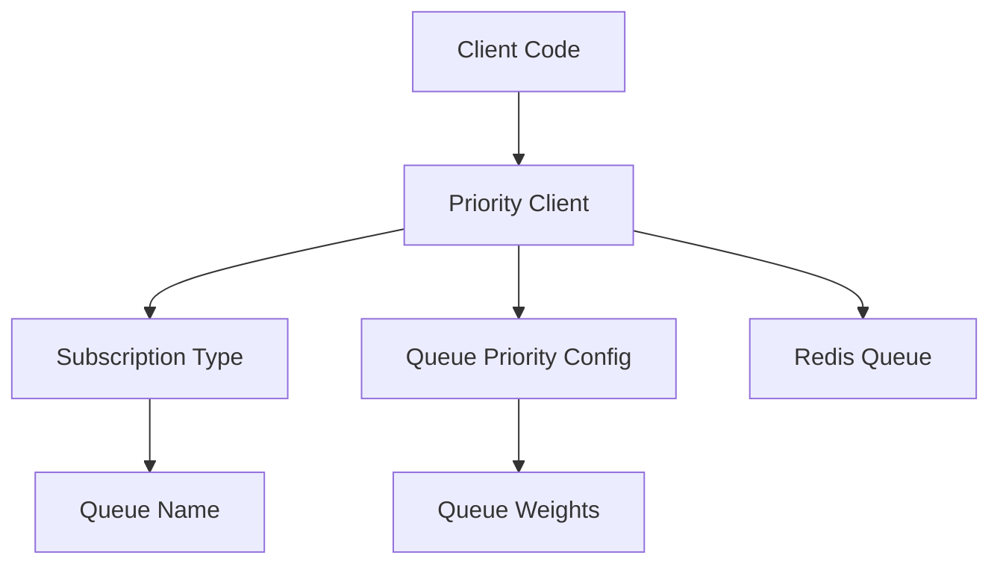

# Priority Queue Design Document

The **Priority Queue** package introduces a subscription-based task prioritization layer on top of Asynq, ensuring fair resource allocation according to defined subscription tiers. By isolating queues per subscription type and providing flexible priority configurations, this system supports complex, distributed task processing environments that need to cater to varying service levels (e.g., free, pro, enterprise).  

---

## Overview

The **Priority Queue** package is designed to:

1. **Manage Multiple Subscription Tiers**: Tasks are routed based on subscription types, ensuring higher-tier subscribers receive priority access to resources.  
2. **Enforce Strong Typing**: Subscription tiers are defined as constants (e.g., free, pro, enterprise) to prevent misconfiguration.  
3. **Provide Flexible Priority Settings**: Both weighted and strict priority options allow fine-tuned resource allocation according to business requirements.  
4. **Scale Seamlessly**: Built on Redis and Asynq, the system supports horizontal scaling in both task producers (clients) and consumers (workers).  

---

## Architecture

### Core Components

1. **Client**  
   - **Role**: A wrapper around the Asynq client that routes tasks to the correct queues based on subscription tier.  
   - **Implementation Details**:  
     - Intercepts enqueue requests to ensure each task goes to the correct subscription queue.  
     - Preserves the underlying Asynq features, allowing use of all standard Asynq task options.  

2. **Subscription Types**  
   - **Role**: Define a set of valid subscription tiers (e.g., `free`, `pro`, `enterprise`) as strongly typed constants.  
   - **Implementation Details**:  
     - Allows compile-time checks to avoid invalid subscriptions.  
     - Provides validation methods to confirm correct subscription usage.  

3. **Queue Priority Config**  
   - **Role**: Holds the configuration for both weighted and strict priority modes.  
   - **Implementation Details**:  
     - Specifies the relative weights or strict ordering among different subscription queues.  
     - Example usage: ensuring `enterprise` tasks always run before `free` tasks, or weighting `enterprise` more heavily than `pro` tasks.

### Component Interactions



- **Client Code**: Your application code that creates or dispatches tasks.
- **Priority Client**: The key wrapper around Asynq’s client; it routes tasks based on subscription and enforces priority configurations.
- **Subscription Type**: Defines valid subscription tiers and their associated queue names.
- **Queue Priority Config**: Configuration object describing how different tiers are prioritized (e.g., `Weights`, `StrictPriority`).
- **Redis Queue**: Underlying Redis-based queue(s) managed by Asynq for task scheduling and distribution.

---

## Design Decisions

### 1. Strong Type Safety

**Decision**  
Use **custom subscription type constants** (e.g., `SubscriptionTypeFree`, `SubscriptionTypePro`, `SubscriptionTypeEnterprise`) rather than generic strings.

**Rationale**  
- Compile-time validation prevents accidental typos.  
- IDE autocompletion fosters more accurate development.  
- Makes business logic for subscription tiers explicit.

**Implementation**  
```go
type SubscriptionType string

const (
    SubscriptionTypeFree       SubscriptionType = "free"
    SubscriptionTypePro        SubscriptionType = "pro"
    SubscriptionTypeEnterprise SubscriptionType = "enterprise"
)

func (s SubscriptionType) IsValid() bool {
    switch s {
    case SubscriptionTypeFree, SubscriptionTypePro, SubscriptionTypeEnterprise:
        return true
    default:
        return false
    }
}
```
- Invalid subscription types can be caught early, either at compile time (due to constants) or at runtime via `IsValid()` checks.

---

### 2. Queue Isolation

**Decision**  
Maintain a **dedicated queue for each subscription tier**.

**Rationale**  
- **Prevents Priority Inversion**: Ensures high-tier tasks are not blocked by lower-tier tasks.  
- **Accurate Resource Allocation**: Simplifies distribution of worker resources (e.g., worker counts, concurrency settings) per subscription level.  
- **Easier Monitoring**: Administrators can track queue performance (e.g., queue depth, throughput) on a per-subscription basis.

**Trade-offs**  
- A **fixed number of queues** must be managed, which can increase configuration overhead.  
- Each additional queue potentially increases **Redis resource usage**.  
- Worker configuration complexity rises because you may need separate workers or concurrency settings for each queue.

---

### 3. Priority Configuration

**Decision**  
Provide **both weighted and strict priority** modes via a central configuration object.

**Rationale**  
- **Flexibility**: Weighted mode allows a more equitable balance between tiers (e.g., pro tier could have half the resources of enterprise but more than free).  
- **Strict**: A strict priority mode ensures that higher tiers are always served first before any lower-tier tasks are considered.  
- **Adaptable Business Models**: This supports diverse scenarios, from pay-as-you-go to strict SLAs for critical tasks.

**Example**  
```go
type QueuePriorityConfig struct {
    StrictPriority bool
    Weights        map[SubscriptionType]int
}
```
- When `StrictPriority` is true, tasks from higher-tier queues must always be processed first if they are available.  
- `Weights` define relative capacity when `StrictPriority` is false.

---

### 4. Client Wrapper

**Decision**  
Rather than extending the Asynq client directly, **wrap it** within a custom `Client` type.

**Rationale**  
- **Separation of Concerns**: The original Asynq client remains untouched, ensuring simpler upgrades and maintenance.  
- **Easier Testing**: Unit tests can be performed on the wrapper with mock or real Asynq clients.  
- **Non-invasive**: Maintains the original Asynq usage patterns, making it straightforward for existing Asynq users to adopt.

**Implementation**  
```go
type Client struct {
    client *asynq.Client
    config *QueuePriorityConfig
}
```
- The wrapper holds a reference to the real Asynq client and enforces subscription-based queue assignment.

---

### 5. Task Options

**Decision**  
Continue to support **Asynq’s existing task options** (`Timeout`, `MaxRetry`, etc.), while enforcing correct queue usage.

**Rationale**  
- **Maintain Feature Parity**: Developers can still leverage existing Asynq features without losing priority-based routing.  
- **Prevent Queue Misconfiguration**: The wrapper appends the correct queue name automatically, overriding any manually set queue option to ensure consistency.

**Implementation**  
```go
func (c *Client) EnqueueTask(
    ctx context.Context,
    task *asynq.Task,
    subType SubscriptionType,
    opts ...asynq.Option,
) (*asynq.TaskInfo, error) {
    // Validate subscription
    if !subType.IsValid() {
        return nil, fmt.Errorf("invalid subscription type: %s", subType)
    }

    // Derive the queue name from the subscription
    queueName := subType.GetQueueName()

    // Enforce correct queue usage
    opts = append(opts, asynq.Queue(queueName))

    // Delegate enqueue to the underlying Asynq client
    return c.client.Enqueue(task, opts...)
}
```
- Ensures each task is enqueued to the subscription-specific queue.  
- Extra validations or fallback logic can be added as needed.

---

## Testing Strategy

### 1. Unit Tests

**Decision**  
Use **test containers** for Redis testing and write comprehensive unit tests around the priority client.

**Rationale**  
- **Isolated Environment**: Each test runs against a fresh Redis instance, eliminating cross-test interference.  
- **Predictable**: No external dependencies other than Docker for test containers.  
- **Coverage**: Verifies subscription validation, queue assignment, and error handling logic thoroughly.

**Implementation Snippet**  
```go
func TestClient_EnqueueTask(t *testing.T) {
    client := getTestClient() // returns a test client with a Redis test container
    defer client.Close()

    for _, subType := range []SubscriptionType{
        SubscriptionTypeFree,
        SubscriptionTypePro,
        SubscriptionTypeEnterprise,
    } {
        // Attempt to enqueue a task
        task := asynq.NewTask("test_task", nil)
        info, err := client.EnqueueTask(context.Background(), task, subType)
        require.NoError(t, err)
        require.NotNil(t, info)
        
        // Assert correct queue name, etc.
    }
}
```
- Ensures each subscription type maps to the correct queue and handles tasks properly.

---

### 2. Integration Tests

**Decision**  
Run **end-to-end** tests with real workers processing tasks to verify priority behavior and ensure tasks are distributed as intended.

**Rationale**  
- **Realistic Workloads**: Confirms that tasks enqueued in different subscription tiers obey configured priorities when multiple workers are running.  
- **Validates Resource Allocation**: Ensures enterprise tasks, for example, are processed faster or more frequently than free-tier tasks under load.  
- **Catch Edge Cases**: Identifies issues that might only appear in concurrent, distributed environments.

---

## Performance Considerations

### 1. Queue Management

- **Dedicated Queues**: Minimizes lock contention and ensures clear separation of tasks.  
- **Worker Pools**: Configurable concurrency per queue prevents bottlenecks and makes scaling straightforward.

### 2. Memory Usage

- **Minimal Overhead**: Priority logic mostly sits in the client layer. Redis memory usage scales primarily with the quantity of tasks.  
- **Queue Storage**: Redis is responsible for queue persistence, meaning the application’s memory footprint remains small.

### 3. Task Processing

- **Non-blocking Enqueue**: Tasks are enqueued asynchronously, allowing the client to remain responsive.  
- **Priority-based Distribution**: When using weighted or strict priorities, Asynq workers will fetch tasks from higher-priority queues first if so configured.

---

## Scalability

### Horizontal Scaling

The system scales along three main dimensions:

1. **Worker Scaling**  
   - **Independent Worker Pools**: Each queue can have its own pool size.  
   - **Dynamic Scaling**: Autoscale based on queue depth or CPU/memory metrics.  
   - **Configuration Flexibility**: Allocate more resources to premium subscription queues.

2. **Client Distribution**  
   - **Multiple Clients**: Any number of clients can enqueue tasks from various microservices or user applications.  
   - **Redis Coordination**: Redis automatically handles concurrency and task ordering.

3. **Queue Performance**  
   - **Redis Cluster**: For very large workloads, a Redis cluster can be used for sharding and load distribution.  
   - **Linear Worker Scaling**: Adding more workers typically increases throughput, as each queue is isolated.

---

## Future Improvements

1. **Dynamic Priorities**  
   - **Runtime Updates**: Adjust priority weights or switch between strict/weighted modes without redeploying.  
   - **Load-based Tuning**: Automatically shift weights according to real-time queue metrics (e.g., if enterprise queue is overloaded, temporarily increase capacity).

2. **Enhanced Monitoring**  
   - **Metrics**: Per-queue metrics (e.g., queue depth, average wait time) exposed to Prometheus or a similar monitoring platform.  
   - **Priority Effectiveness**: Analytics to confirm that premium subscribers indeed receive faster turnaround times.

3. **Smart Scheduling**  
   - **Priority Aging**: Gradually elevate the priority of tasks that remain in the queue too long, ensuring fairness even for lower tiers.  
   - **Load Balancing**: Dispatch tasks to different clusters or regions automatically.

4. **Resource Controls**  
   - **Rate Limiting**: Cap the rate of enqueue operations per subscription type to prevent abuse.  
   - **Quotas**: Impose daily/monthly usage limits to enforce subscription policies.  
   - **Burst Handling**: Allow short bursts of high enqueue rates for premium subscribers, then throttle to normal levels.

---

## Security Considerations

1. **Access Control**  
   - **Subscription Verification**: Ensure tasks are only created for valid and authorized subscription tiers.  
   - **Queue Restrictions**: Enforce subscription-based rules to prevent cross-tier interactions.  
   - **Client Authentication**: Use Redis password/TLS to secure connections.

2. **Resource Protection**  
   - **Queue Isolation**: Minimizes the risk of one queue’s load overwhelming others.  
   - **Rate Limiting**: Thwarts potential denial-of-service scenarios by setting upper bounds per subscription tier.

3. **Data Safety**  
   - **Task Payload Validation**: Validate incoming data to avoid harmful payloads (e.g., injection attacks).  
   - **Consistent Cleanup**: Implement periodic cleanups for stale tasks.  
   - **Error Handling**: Ensure robust logging and alerts for unexpected or malicious activity.

---

## Operational Considerations

1. **Monitoring**  
   - **Queue Depth**: Track the length of each queue to detect backlogs quickly.  
   - **Processing Rates**: Measure tasks processed per second or minute.  
   - **Error Rates**: Alert if enqueue or processing errors exceed a certain threshold.

2. **Alerting**  
   - **Queue Backlog**: Generate alerts if tasks remain unprocessed for too long.  
   - **Processing Delays**: Notify operators when higher-tier tasks are taking too long.  
   - **Error Thresholds**: Automated escalation for repeated enqueue failures or worker crashes.

3. **Maintenance**  
   - **Queue Cleanup**: Remove or archive completed tasks regularly to free Redis memory.  
   - **Priority Adjustments**: Tweak weights and strict priority settings as business needs evolve.  
   - **Worker Scaling**: Adjust worker concurrency for each queue to match demand.

---

## Best Practices for Implementation

1. **Client Usage**
   ```go
   // Create a client with appropriate priority configuration
   client := priorityqueue.NewClient(redisOpt, &priorityqueue.QueuePriorityConfig{
       StrictPriority: true,
       Weights: map[SubscriptionType]int{
           SubscriptionTypeEnterprise: 100,
           SubscriptionTypePro:        50,
           SubscriptionTypeFree:       10,
       },
   })

   // Always close the client when you're done
   defer client.Close()
   ```

2. **Worker Setup**
   ```go
   // Configure an Asynq server with matching queues and weights
   srv := asynq.NewServer(redisOpt, asynq.Config{
       Queues: map[string]int{
           "enterprise": 100,
           "pro":        50,
           "free":       10,
       },
   })
   // Register task handlers and start the server as usual
   ```

3. **Error Handling**
   ```go
   // Validate subscription before enqueue
   if !subType.IsValid() {
       return fmt.Errorf("invalid subscription: %s", subType)
   }

   // Handle enqueue errors
   info, err := client.EnqueueTask(ctx, task, subType)
   if err != nil {
       // Log or send to monitoring
       log.Printf("Error enqueuing task: %v", err)
   }
   ```

---

## References

1. [Asynq Documentation](https://github.com/hibiken/asynq)  
2. [Redis Queue Patterns](https://redis.io/docs/manual/patterns/queues/)  
3. [Priority Queue Theory](https://en.wikipedia.org/wiki/Priority_queue)  
4. [Distributed System Patterns](https://martinfowler.com/articles/patterns-of-distributed-systems/)

---

**Conclusion**  
The **Priority Queue** package enhances Asynq’s task scheduling capabilities by integrating subscription-based routing and flexible priority controls. This design ensures robust isolation between subscription tiers, prevents priority inversions, and delivers consistent, predictable performance for high-priority tasks. By combining best practices like strong type safety, configurable queue isolation, and robust error handling, this solution is well-suited for any distributed system handling diverse service-level agreements. With future plans for dynamic priority updates, load-based monitoring, and advanced scheduling features, the package aims to offer a truly enterprise-grade priority queueing solution.