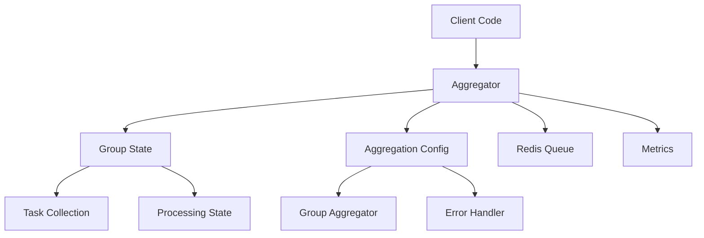

# Redis Aggregator Design Document

## Overview

The Redis Aggregator package implements a sophisticated task batching system built on top of [Asynq](https://github.com/hibiken/asynq). It automatically combines related tasks into batches based on configurable criteria, improving system efficiency and reducing resource consumption in high-volume distributed environments.

### Key Features

1. **Dynamic Task Aggregation**
   - Automatic batching of related tasks
   - Configurable grouping criteria
   - Custom aggregation logic per group

2. **Time-based Processing**
   - Configurable grace periods
   - Maximum delay thresholds
   - Adaptive processing triggers

3. **Resource Management**
   - Maximum batch size limits
   - Memory usage controls
   - Thread-safe operations

4. **Reliability Features**
   - Error handling and recovery
   - Graceful shutdown
   - Task persistence

5. **Monitoring & Observability**
   - Group state tracking
   - Performance metrics
   - Debug logging

---

## Architecture

### Core Components

#### 1. Aggregator
The central component managing task collection and processing:

```go
type Aggregator struct {
    mu sync.RWMutex
    groups map[string]*groupState
    client *asynq.Client
    config *AggregationConfig
    wg     sync.WaitGroup
    done   chan struct{}
    
    // Metrics and monitoring
    metrics struct {
        activeGroups    atomic.Int64
        processedTasks  atomic.Int64
        aggregatedTasks atomic.Int64
    }
}
```

Key responsibilities:
- Task collection and grouping
- Processing timing management
- Resource cleanup
- Metrics collection

#### 2. Group State
Maintains the state for each active group:

```go
type groupState struct {
    tasks      []*asynq.Task
    createTime time.Time
    updateTime time.Time
    size       atomic.Int32
    processing atomic.Bool
}

func newGroupState() *groupState {
    return &groupState{
        tasks:      make([]*asynq.Task, 0),
        createTime: time.Now(),
        updateTime: time.Now(),
    }
}
```

Features:
- Thread-safe task collection
- Timing metadata
- Processing state flags

#### 3. Aggregation Config
Configuration parameters controlling aggregation behavior:

```go
type AggregationConfig struct {
    // Timing controls
    GroupGracePeriod time.Duration
    GroupMaxDelay    time.Duration
    
    // Size limits
    GroupMaxSize     int
    MaxGroups        int
    
    // Custom logic
    GroupAggregator  GroupAggregator
    ErrorHandler     ErrorHandler
    
    // Advanced options
    EnableMetrics    bool
    MetricsPrefix    string
    ShutdownTimeout  time.Duration
}

type GroupAggregator func(group string, tasks []*asynq.Task) (*asynq.Task, error)
type ErrorHandler func(group string, err error)
```

### Component Interactions



1. **Task Flow**:
   ```
   Client Code → Aggregator → Group State → Redis Queue
   ```

2. **Configuration Flow**:
   ```
   Aggregation Config → Aggregator → Processing Logic
   ```

3. **Monitoring Flow**:
   ```
   Aggregator → Metrics → External Monitoring
   ```

---

## Implementation Details

### 1. Task Addition

The core method for adding tasks to groups:

```go
func (a *Aggregator) AddTask(ctx context.Context, task *asynq.Task) error {
    if task == nil {
        return ErrNilTask
    }
    
    groupKey := task.GroupKey()
    if groupKey == "" {
        return ErrEmptyGroupKey
    }
    
    a.mu.Lock()
    defer a.mu.Unlock()
    
    // Check group limits
    if len(a.groups) >= a.config.MaxGroups {
        return ErrTooManyGroups
    }
    
    // Get or create group
    state, exists := a.groups[groupKey]
    if !exists {
        state = newGroupState()
        a.groups[groupKey] = state
        a.metrics.activeGroups.Add(1)
    }
    
    // Add task to group
    state.tasks = append(state.tasks, task)
    state.updateTime = time.Now()
    state.size.Add(1)
    
    // Check if immediate processing is needed
    if state.size.Load() >= int32(a.config.GroupMaxSize) {
        go a.processGroup(ctx, groupKey, state)
    }
    
    return nil
}
```

Key features:
- Thread-safe group management
- Group size limits
- Immediate processing triggers
- Metrics updates

### 2. Group Processing

The logic for processing task groups:

```go
func (a *Aggregator) processGroup(ctx context.Context, groupKey string, state *groupState) {
    // Ensure only one processing routine per group
    if !state.processing.CompareAndSwap(false, true) {
        return
    }
    defer state.processing.Store(false)
    
    a.wg.Add(1)
    defer a.wg.Done()
    
    // Copy tasks for processing
    a.mu.RLock()
    tasks := make([]*asynq.Task, len(state.tasks))
    copy(tasks, state.tasks)
    a.mu.RUnlock()
    
    // Apply custom aggregation
    aggregatedTask, err := a.config.GroupAggregator(groupKey, tasks)
    if err != nil {
        if a.config.ErrorHandler != nil {
            a.config.ErrorHandler(groupKey, err)
        }
        return
    }
    
    // Enqueue the aggregated task
    info, err := a.client.EnqueueContext(ctx, aggregatedTask)
    if err != nil {
        if a.config.ErrorHandler != nil {
            a.config.ErrorHandler(groupKey, err)
        }
        return
    }
    
    // Update metrics
    a.metrics.processedTasks.Add(int64(len(tasks)))
    a.metrics.aggregatedTasks.Add(1)
    
    // Cleanup
    a.mu.Lock()
    delete(a.groups, groupKey)
    a.metrics.activeGroups.Add(-1)
    a.mu.Unlock()
}
```

Features:
- Atomic processing flags
- Safe task copying
- Error handling
- Metrics updates
- Resource cleanup

### 3. Background Processing

Periodic check for groups that need processing:

```go
func (a *Aggregator) runProcessingLoop(ctx context.Context) {
    ticker := time.NewTicker(time.Second)
    defer ticker.Stop()
    
    for {
        select {
        case <-ctx.Done():
            return
        case <-ticker.C:
            a.checkGroups(ctx)
        }
    }
}

func (a *Aggregator) checkGroups(ctx context.Context) {
    now := time.Now()
    
    a.mu.RLock()
    groupsToProcess := make([]string, 0)
    for key, state := range a.groups {
        if a.shouldProcess(state, now) {
            groupsToProcess = append(groupsToProcess, key)
        }
    }
    a.mu.RUnlock()
    
    // Process identified groups
    for _, key := range groupsToProcess {
        if state := a.getGroupState(key); state != nil {
            go a.processGroup(ctx, key, state)
        }
    }
}

func (a *Aggregator) shouldProcess(state *groupState, now time.Time) bool {
    // Don't process if already processing
    if state.processing.Load() {
        return false
    }
    
    // Check grace period
    if now.Sub(state.updateTime) < a.config.GroupGracePeriod {
        return false
    }
    
    // Check max delay
    if now.Sub(state.createTime) >= a.config.GroupMaxDelay {
        return true
    }
    
    return false
}
```

Features:
- Periodic group checking
- Time-based processing triggers
- Concurrent processing
- State protection

### 4. Graceful Shutdown

Clean shutdown implementation:

```go
func (a *Aggregator) Stop() error {
    close(a.done)
    
    // Wait for processing to complete
    c := make(chan struct{})
    go func() {
        a.wg.Wait()
        close(c)
    }()
    
    // Wait with timeout
    select {
    case <-c:
        return nil
    case <-time.After(a.config.ShutdownTimeout):
        return ErrShutdownTimeout
    }
}
```

Features:
- Processing completion wait
- Configurable timeout
- Resource cleanup

---

## Performance Considerations

### 1. Memory Management

- **Group Storage**
  ```go
  // Preallocate task slices for known sizes
  tasks := make([]*asynq.Task, 0, a.config.GroupMaxSize)
  ```

- **Copy-on-Write**
  ```go
  // Copy tasks before processing to prevent locks
  tasksCopy := make([]*asynq.Task, len(state.tasks))
  copy(tasksCopy, state.tasks)
  ```

### 2. Concurrency Control

- **Fine-grained Locking**
  ```go
  // Use RWMutex for better read concurrency
  a.mu.RLock()
  state, exists := a.groups[groupKey]
  a.mu.RUnlock()
  
  if exists {
      // Modify state with write lock
      a.mu.Lock()
      // modifications
      a.mu.Unlock()
  }
  ```

### 3. Resource Limits

- **Group Limits**
  ```go
  if len(a.groups) >= a.config.MaxGroups {
      return ErrTooManyGroups
  }
  ```

- **Task Limits**
  ```go
  if state.size.Load() >= int32(a.config.GroupMaxSize) {
      return ErrGroupFull
  }
  ```

---

## Monitoring & Observability

### 1. Metrics Collection

```go
type metrics struct {
    // Counters
    activeGroups    atomic.Int64
    processedTasks  atomic.Int64
    aggregatedTasks atomic.Int64
    
    // Gauges
    avgGroupSize    atomic.Int64
    avgWaitTime     atomic.Int64
    
    // Histograms
    processingDuration prometheus.Histogram
}
```

### 2. Health Checks

```go
func (a *Aggregator) HealthCheck() error {
    // Check Redis connection
    if err := a.client.HealthCheck(); err != nil {
        return fmt.Errorf("redis health check failed: %w", err)
    }
    
    // Check group limits
    if a.metrics.activeGroups.Load() >= int64(a.config.MaxGroups) {
        return ErrGroupLimitReached
    }
    
    return nil
}
```

### 3. Debug Logging

```go
func (a *Aggregator) logDebug(format string, args ...interface{}) {
    if a.config.EnableDebug {
        log.Printf("[AGGREGATOR] "+format, args...)
    }
}
```

---

## Error Handling & Recovery

### 1. Error Types

```go
var (
    ErrNilTask          = errors.New("task cannot be nil")
    ErrEmptyGroupKey    = errors.New("group key cannot be empty")
    ErrTooManyGroups    = errors.New("maximum number of groups reached")
    ErrGroupFull        = errors.New("group has reached maximum size")
    ErrShutdownTimeout  = errors.New("shutdown timed out")
)
```

### 2. Recovery Mechanisms

```go
func (a *Aggregator) processGroupSafe(ctx context.Context, groupKey string, state *groupState) {
    defer func() {
        if r := recover(); r != nil {
            a.logError("panic in processGroup: %v", r)
            if a.config.ErrorHandler != nil {
                a.config.ErrorHandler(groupKey, fmt.Errorf("panic: %v", r))
            }
        }
    }()
    
    a.processGroup(ctx, groupKey, state)
}
```

### 3. Retry Logic

```go
func (a *Aggregator) enqueueWithRetry(ctx context.Context, task *asynq.Task) error {
    var lastErr error
    for i := 0; i < 3; i++ {
        if _, err := a.client.EnqueueContext(ctx, task); err != nil {
            lastErr = err
            time.Sleep(time.Second * time.Duration(i+1))
            continue
        }
        return nil
    }
    return fmt.Errorf("failed to enqueue after retries: %w", lastErr)
}
```

---

## Best Practices

### 1. Configuration

```go
func DefaultConfig() *AggregationConfig {
    return &AggregationConfig{
        GroupGracePeriod: 30 * time.Second,
        GroupMaxDelay:    5 * time.Minute,
        GroupMaxSize:     100,
        MaxGroups:        1000,
        ShutdownTimeout:  time.Minute,
        EnableMetrics:    true,
        MetricsPrefix:    "aggregator",
    }
}
```

### 2. Group Key Design

```go
// Hierarchical keys for better organization
groupKey := fmt.Sprintf("%s:%s:%s", service, category, subcategory)

// Time-based keys for temporal grouping
groupKey := fmt.Sprintf("notifications:%s", time.Now().Format("2006-01-02"))

// User-based keys for personalization
groupKey := fmt.Sprintf("user:%d:emails", userID)
```

### 3. Aggregation Logic

```go
func emailAggregator(group string, tasks []*asynq.Task) (*asynq.Task, error) {
    if len(tasks) == 0 {
        return nil, nil
    }
    
    // Combine email recipients
    recipients := make([]string, 0, len(tasks))
    for _, task := range tasks {
        if email, ok := task.Payload["email"].(string); ok {
            recipients = append(recipients, email)
        }
    }
    
    // Create batch email task
    return asynq.NewTask(
        "email:batch",
        map[string]interface{}{
            "recipients": recipients,
            "template":   tasks[0].Payload["template"],
            "count":     len(recipients),
        },
    ), nil
}
```

---

## Future Improvements

### 1. Advanced Features

- Dynamic grace periods based on group activity
- Priority-based aggregation
- Cross-group aggregation
- Distributed aggregation across multiple nodes

### 2. Performance Enhancements

- Sharded group storage
- Adaptive batch sizing
- Background group cleanup
- Memory-efficient task storage

### 3. Monitoring Improvements

- Real-time metrics streaming
- Custom metric exporters
- Detailed timing analysis
- Group state visualization

---

## References

1. [Asynq Documentation](https://github.com/hibiken/asynq)
2. [Redis Pub/Sub Patterns](https://redis.io/topics/pubsub)
3. [Go Concurrency Patterns](https://blog.golang.org/pipelines)
4. [Distributed Systems Design](https://martinfowler.com/articles/patterns-of-distributed-systems/)

---

## Conclusion

The Redis Aggregator package provides a robust, efficient solution for task batching in distributed systems. Through careful attention to concurrency, resource management, and error handling, it delivers reliable task aggregation while maintaining system stability and performance. The design emphasizes flexibility and extensibility, allowing for custom aggregation logic and monitoring integration while providing sensible defaults for immediate use.