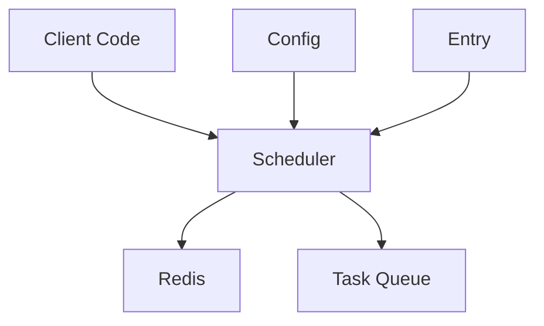

# Comprehensive Redis Scheduler Design Document

## Overview

The **Redis Scheduler** package is a robust, production-grade scheduling system tailored for distributed applications. It is built on top of the [Asynq](https://github.com/hibiken/asynq) library, leveraging Asynq’s reliable task scheduling and queuing mechanisms. This package introduces additional enterprise-focused features, such as thread safety, immutability of configuration at runtime, and first-class error handling. The result is a safer, more predictable, and highly scalable scheduling solution suitable for environments with demanding performance and availability requirements.

Key highlights include:

1. **Enhanced Reliability**: By building atop Asynq, the system inherits a proven task-queuing mechanism.
2. **Enterprise-Grade Safeguards**: Thread safety, controlled runtime immutability, and robust error handling.
3. **Flexible Configuration**: Support for time zones, graceful shutdown, and customizable error handling strategies.
4. **Scalability and Observability**: Horizontal scaling with leader election, plus the option to integrate advanced monitoring tools.

---

## Architecture

### Core Components

1. **Scheduler**
   - **Role**: Serves as the central orchestration unit responsible for registering and managing the scheduled tasks. It initializes, starts, and stops the scheduling process.
   - **Implementation Details**:  
     - Utilizes a read-write mutex (`sync.RWMutex`) to maintain thread safety across concurrent operations.  
     - Defines a shared in-memory map to store references to all registered tasks (referred to as "entries").  
     - Manages its own lifecycle through dedicated `Start` and `Stop` methods, ensuring graceful transitions and cleanup.
   - **Why It’s Important**: It enforces consistency in scheduling across distributed environments and ensures that tasks are triggered at the correct times.

2. **Config**
   - **Role**: Governs the runtime behavior of the scheduler and defines how tasks are executed, logged, and recovered from errors.
   - **Implementation Details**:
     - Constructed once and remains **immutable** throughout the scheduler’s lifetime.  
     - Incorporates sensible defaults to minimize the configuration needed for common use cases.  
     - Supports optional customization for error handling, time zones, shutdown behavior, and logging.  
   - **Why It’s Important**: Immutable configurations prevent unintentional changes during runtime, thereby increasing system reliability.

3. **Entry**
   - **Role**: Represents an individual scheduled task, encapsulating all relevant metadata, such as the interval, the task payload, and the scheduling policy.
   - **Implementation Details**:
     - Holds details like the name of the task, the next run time, and the history of runs and their outcomes.
     - May include advanced data like the last run result, number of retries, and additional options for the underlying Asynq task.
   - **Why It’s Important**: A single source of truth for each scheduled task, ensuring consistency and traceability of execution across the cluster.

### Component Interactions



- **Client Code**: External application components that register tasks with the scheduler.
- **Scheduler**: The core orchestrator that communicates both with Redis and the task queue.
- **Redis**: Acts as the persistence and coordination layer for tasks, especially important for distributed setups.
- **Task Queue**: Receives enqueued tasks from the scheduler, distributing them to worker processes.
- **Config**: Supplies the fixed configuration parameters to the scheduler at creation.
- **Entry**: Represents the scheduled tasks managed by the scheduler.

---

## Design Decisions

### 1. Thread Safety

**Decision**  
Use a **read-write mutex** (`sync.RWMutex`) for all operations that modify or read the internal scheduler state.

**Rationale**  
- Enables concurrent read operations (e.g., querying scheduled tasks) without blocking.  
- Ensures only one writer at a time can modify the scheduler state, preventing race conditions in concurrent environments.  
- Promotes stable, predictable behavior under load.

**Implementation**  
```go
type Scheduler struct {
    mu         sync.RWMutex
    entries    map[string]Entry
    isRunning  bool
    // ...
}
```
- The `mu` field ensures synchronization.  
- Operations like adding or removing tasks acquire a write lock, while read-only operations (e.g., retrieving task metadata) use a read lock.

---

### 2. Immutable Runtime State

**Decision**  
Prevent the registration or unregistration of tasks while the scheduler is in a running state.

**Rationale**  
- Simplifies the internal logic of the scheduler by disallowing dynamic changes that could lead to race conditions or state inconsistencies.  
- Improves predictability of task execution cycles, because tasks can only be modified or removed when the scheduler is stopped.  
- Avoids edge cases where a task is being removed or modified exactly when it’s due to run.

**Trade-offs**  
- **Pros**: Greatly reduces complexity, fewer concurrency pitfalls, safer scheduling guarantees.  
- **Cons**: Users must **restart** or **stop** the scheduler to change tasks, reducing flexibility in scenarios that demand hot updates.

---

### 3. Error Handling

**Decision**  
Support **custom error handlers** that integrate with a variety of logging, monitoring, and alerting tools, with a robust default fallback if no custom handler is provided.

**Rationale**  
- Facilitates enterprise-level monitoring by allowing system admins to define how errors are logged or managed.  
- Enables different recovery strategies (e.g., immediate retries, dead-letter queueing, alert notifications) without altering core logic.  
- Maintains a default handler to ensure that unhandled errors don’t lead to silent failures.

**Example**  
```go
type Config struct {
    ErrorHandler func(task *asynq.Task, opts []asynq.Option, err error)
    // ...
}
```
- If `ErrorHandler` is not provided, a default implementation logs errors and proceeds with a standard retry mechanism.

---

### 4. Time Zone Support

**Decision**  
Incorporate **first-class time zone support**, defaulting to UTC if no location is specified.

**Rationale**  
- Many global applications must handle tasks across multiple regions and time zones.  
- Proper time zone handling eliminates confusion around daylight savings and local time differences.  
- Ensures consistent scheduling logic for tasks that must run at specific local times.

**Implementation**  
```go
if config.Location == nil {
    config.Location = time.UTC
}
```
- Every scheduling calculation (e.g., cron expressions, interval timers) is performed in the specified `time.Location`.  
- By default, tasks will be scheduled in UTC to avoid ambiguity.

---

### 5. Graceful Shutdown

**Decision**  
Implement a **configurable shutdown timeout**, which ensures active tasks complete and the scheduler can perform necessary cleanup.

**Rationale**  
- Protects running tasks from abrupt termination and data corruption.  
- Gives the system a window to flush logs, close connections, or cancel pending tasks cleanly.  
- Aligns with best practices for microservice deployments, especially in containerized environments.

**Implementation**  
```go
func (s *Scheduler) Stop() error {
    ctx, cancel := context.WithTimeout(context.Background(), s.config.ShutdownTimeout)
    defer cancel()
    // Perform shutdown logic such as waiting for active tasks to finish
    // Return any errors encountered or nil on successful graceful stop
}
```
- A `context.WithTimeout` is employed to limit the maximum duration of the shutdown sequence.  
- If tasks aren’t completed within the timeout window, the scheduler cancels remaining tasks and closes gracefully.

---

## Testing Strategy

### 1. Test Container Integration

**Decision**  
Use [testcontainers-go](https://github.com/testcontainers/testcontainers-go) for **isolated Redis testing** in CI/CD pipelines.

**Rationale**  
- Enables fully reproducible Redis instances for testing without external dependencies.  
- Allows for easy integration and teardown within automated test scripts.  
- Makes it straightforward to run tests in local development or continuous integration environments.

**Implementation**  
```go
func setupRedisContainer(ctx context.Context) (testcontainers.Container, string, error) {
    // Creates and starts a Redis container
    // Returns the container object and a connection URL
}
```
- Each test creates a new container, ensuring a clean slate.  
- The container is automatically stopped and removed post-test, preventing resource leaks.

---

### 2. Clean State Per Test

**Decision**  
Use a **helper function** to initialize a new scheduler instance for every test run with default or custom test configurations.

**Rationale**  
- Prevents cross-test interference by reusing global state.  
- Facilitates more reliable and predictable test outcomes.  
- Simplifies test logic by guaranteeing a fresh environment each time.

**Implementation**  
```go
func getTestScheduler() *Scheduler {
    return New(redisOpt, &Config{
        // Provide test-specific config if needed
    })
}
```
- Ensures each test has its own scheduler instance, fully isolated from other tests.  
- Particularly useful for concurrency and error-handling tests where shared state can cause false positives or negatives.

---

## Performance Considerations

### 1. Memory Usage

- **In-Memory Entries**: The scheduler maintains an in-memory `map[string]Entry`, which can grow with the number of scheduled tasks. 
- **Redis Persistence**: Actual task data and scheduling states are also persisted in Redis, reducing the memory footprint on the application server.
- **Planning for Growth**: If tasks are expected to scale into the tens or hundreds of thousands, it’s advisable to monitor memory usage and possibly shard the scheduling if necessary.

### 2. Redis Operations

- **Minimal Redis Interactions**: The scheduler performs only crucial updates (e.g., registering tasks, updating next run times).  
- **Batching**: Where feasible, certain task updates can be batched to reduce round-trip overhead.  
- **Connection Pooling**: Asynq handles pooling automatically, ensuring efficient reuse of Redis connections.

### 3. Scheduler Loop

- **Single Goroutine**: Core scheduling logic (calculating next run times) executes in a single, dedicated goroutine, preventing excessive context-switch overhead.  
- **Non-Blocking Enqueues**: When tasks become due, they’re enqueued asynchronously, ensuring minimal blocking on the scheduling loop.  
- **Efficient Sorting**: Maintaining a simple structure for tracking the next tasks to run avoids complex sorting overhead on large sets of tasks.

---

## Scalability

### Horizontal Scaling

The scheduler is designed to **scale horizontally**, particularly in high-availability environments. Key features:

1. **Leader Election**  
   - Only one instance actively schedules tasks.  
   - Other instances remain passive “followers” to avoid double-scheduling.  
   - Automatic takeover ensures continuity if the leader fails.

2. **Task Distribution**  
   - Tasks are distributed across multiple worker pools or microservices, depending on how the Asynq workers are set up.  
   - Priority queueing ensures tasks in higher-priority queues are processed first.  
   - Fair distribution across workers to balance load.

3. **State Consistency**  
   - Redis acts as the single source of truth for task states, reducing the risk of data inconsistency.  
   - Critical updates utilize atomic operations or Lua scripts to ensure concurrency safety.  
   - Designed to withstand network partitions or temporary Redis outages with minimal data loss.

---

## Future Improvements

1. **Dynamic Configuration**  
   - Hot reloading of schedules and config without requiring a full scheduler restart.  
   - Real-time updates to existing task entries (e.g., changing intervals or altering error handling).

2. **Enhanced Monitoring**  
   - Integration with [Prometheus](https://prometheus.io/) for detailed metrics (CPU usage, scheduling latency, queue depth).  
   - Built-in health checks and dashboards.  
   - Real-time logs for deeper visibility into scheduling patterns.

3. **Task Dependencies**  
   - Implementation of Directed Acyclic Graph (DAG) scheduling to support tasks that depend on the successful completion of one another.  
   - Conditional scheduling where some tasks only run if other tasks succeed or produce certain outputs.

4. **Advanced Recovery**  
   - More sophisticated retry strategies (e.g., exponential backoff, jitter).  
   - Implementation of a circuit breaker pattern to isolate failing tasks or queues.  
   - Dead-letter queues for tasks that exceed retry limits.

---

## Security Considerations

1. **Redis Security**  
   - Support for TLS-encrypted connections to Redis.  
   - Requires password-based or token-based authentication to connect.  
   - Encourages network isolation (e.g., running Redis in a private subnet or behind a firewall).

2. **Task Validation**  
   - Each task’s data should be carefully validated to prevent injection attacks or excessive payload sizes.  
   - Administrators should configure maximum payload sizes to mitigate denial-of-service risks.  
   - Rate limiting ensures malicious or runaway code doesn’t overload the scheduler.

3. **Access Control**  
   - Fine-grained controls over which applications can register tasks or query the scheduler.  
   - Auditing for administrative operations (e.g., stopping or modifying tasks).  
   - Potential integration with role-based access control systems (RBAC) for multi-tenant environments.

---

## Operational Considerations

1. **Monitoring**  
   - Log task failures with appropriate severity levels.  
   - Capture scheduling delays or missed triggers to detect performance bottlenecks.  
   - Integrate health checks for the scheduler process and Redis connectivity.

2. **Backup and Recovery**  
   - Rely on Redis persistence (RDB/AOF) for task state durability.  
   - Recovery procedures for reconstructing the state if Redis fails or data is corrupted.  
   - Maintain versioned configuration backups to restore previous scheduler setups.

3. **Deployment**  
   - Container-friendly design with minimal external dependencies besides Redis.  
   - Command-line flags or environment variables can configure the scheduler for easy setup in Kubernetes or other container orchestrators.  
   - Health endpoints (e.g., `liveness` and `readiness` probes) for automated restarts and rolling updates.

---

## References

1. [Asynq Documentation](https://github.com/hibiken/asynq)  
2. [Redis Documentation](https://redis.io/documentation)  
3. [Go Concurrency Patterns](https://go.dev/blog/pipelines)  
4. [Distributed Systems Patterns](https://martinfowler.com/articles/patterns-of-distributed-systems/)

---

**Conclusion**: The Redis Scheduler package extends the foundational capabilities of Asynq with additional features necessary for large-scale, mission-critical applications. Through careful design choices like immutable runtime state, robust error handling, and thread-safe operations, it delivers predictable and reliable scheduling across distributed environments. As organizations grow, the scheduler offers a strong path to scalability, security, and extensibility for future enhancements such as dynamic configuration, advanced monitoring, and DAG-based task scheduling.